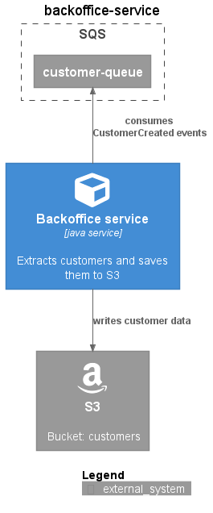

# backoffice-service

This is an example for a simple backoffice service implementation. It consumes CustomerCreated events from a SQS queue. These are then transformed to persistent customers and stored in JSON format in a S3 bucket.

